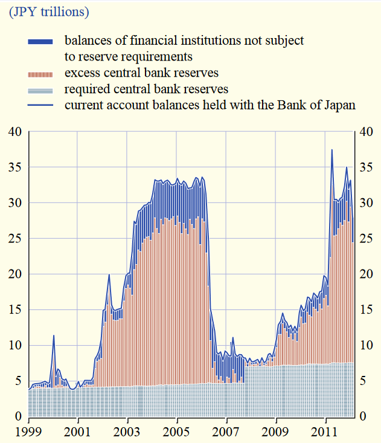

[Back](00.md)

## 2023-10-23

The role of the central bank and creation of money

Three functions of money:

1. Store of value - expected to retain its value predictably through time.
2. Unit of account - common ground/unit of measure for evaluating wealth.
3. Medium of exchange

---

Money on the Asset side must be equal to Money on the Liability side.
Mortgages and bonds are also the same.

REAL assets such as houses, land or gold, do not have a corresponding liability;  
Money in the modern economy is a special form of IOU (I OWE YOU);

Financial Assets are simply claims on someone else in the economy.  
Because financial assets are claims on someone else in the economy.

The sum of $\text{assets} - \text{liabilities} = 0$

In principle there is no need of financial assets such as money.

Money is a social institutions that provides a solution to the problem of a lack of trust.  
Money in the modern economy is IOU an everyone in the economy trusts.

---

Different types of money:

- Currency (banknotes and coin) - the only difference is paper & metal, IOU from the central bank mostly to consumers in the economy
- Central bank reserves, IOU from the central bank to commercial banks
- Bank deposits, IOU from commercial banks to consumers

---

Broad Money:

- Currency
- Bank deposits

Base Money:

- Currency
- Central Bank Reserves

This is one tool of the central bank to control monetary policies.

---

Currency: 94% Bank Notes / 6% Notes

Why we trust money? The central bank keeps the value of money stable by fixing inflation targets (Fixing interest rates).

Keeping stable of money: through time approximately we can buy the same amount of goods with the same amount of money.

**The most important component of money is bank deposits.**

Broad Money is a lot more than Base money.

What is the relationship between base money and broad money?

---

>Reserve Ratio: Central banks, like the Federal Reserve in the United States, set a reserve requirement for commercial banks. This is the amount of money that banks must hold in reserve, typically as a percentage of their deposits. The reserve requirement helps control the amount of money banks can create through the lending process.

>Initial Deposit: It all starts with an initial deposit in a bank. When a person or business deposits money into a bank, that money becomes part of the bank's reserves.

>Reserve Requirement: The bank is required to keep a portion of these deposits as reserves to meet the central bank's reserve requirement. The remaining portion, called excess reserves, can be used for lending and investment.

>Lending and Investment: Banks make loans to borrowers and invest in various financial instruments using their excess reserves. This process effectively multiplies the initial deposit because it allows the money to be in two places at once. For example, if you deposit $1,000 in a bank, and the reserve requirement is 10%, the bank can lend out $900 (leaving $100 as reserves) to a borrower.

>New Deposits: The borrower, upon receiving the $900 loan, might deposit that money in their own bank, which then becomes part of the reserves for that bank.

---

$C_b$ = currency central bank  
$D_b$ = deposits at central bank

$D_p$ = Deposits at the public

Reserve ratio:  
$R = (C_b + D_b) / D_p$ 

The money stock (Broad Money) $M_s  = D_p + C_p$ (Deposits (public) + Currency (public))

*Crucial Point*: the commercial banks can independently affect the quantity of deposits (of money) available in the economy.

A bank decides to provide a loan to an entrepreneur.  
If the entrepreneur is successful, the entrepreneur deposits more money to the same bank.  
So **loans create deposits and not vice-versa**.

If the bank doesn't increase the amount of loans, the amount of deposit doesn't change.

---

Example: if banks provide too many loans into the economy, and they become deposits, people need more liquidity, hence more reserves are required, bank needs for currency, so they ask the central bank, which provides liquidity.

So the money multiplier doesn't hold in this case.

---

For the money multiplier theory to hold, must be a binding constraint on lending, in this case the directly only the discount rate, which controls interest rates.  

---

### Money Creation

Bank deposits are mostly created by commercial banks themselves.  
When a loan is provided they create money.  
When a deposit is provided, money is destroyed.  

When loans a re-payed, money is destroyed.

---
