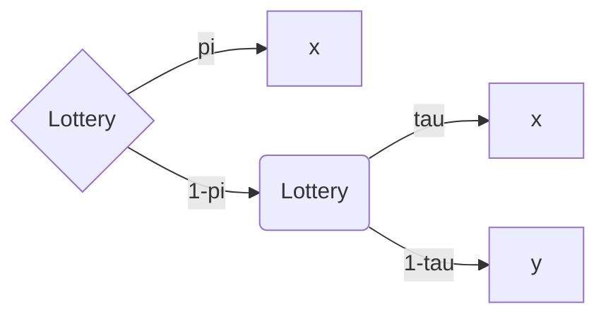

[Back](00.md)

## 2023-10-02

Investment cost = 100

| Inv. |  $\theta_{1}$ | $\theta_{2}$|
| --- |  --- | --- |
| IBM | 100 | 150 |
| RD | 90 | 160 |

$a\succeq b$ if $u(a) \geq u(b)$  
*hence*  
u(100) $\geq$ u(90)

IBM is the best choice for risk-adverse investors.  

---

We can introduce uncertainty $\pi$,
utilities are uncertain, and we have to measure expected utilities.

| Inv. |  $\theta_{1}$ | $\theta_{2}$|
| --- |  --- | --- |
| IBM | 100 | 150 |
| RD | 90 | 160 |

Computing expected utility

$E[u(IBM)] = \pi_1 u(100)+\pi_2 u(150)= H(IBM)$

$E[u(RD)] = \pi_1 u(100)+\pi_2 u(150)= H(RD)$

So we can generalize:  
$IBM \succeq RD \leftrightarrow E[u(IBM)] \geq E[u(RD)]$

or

### Expected Utility Criterion

$a \succeq b \leftrightarrow H(a) \geq H(b)$

---

## Expected Utility Theorem

Simplest possible case: **lottery**

A generic lottery is denoted by $(x,y, \pi)$

With probability $\pi$ you get $x$  
With probability $1-\pi$ you get $y$

$x$ may be $y$ monetary premiums or other lotteries themselves (compound lottery)

---

*compound lottery, 1 nest*  
$(x, (y_1, y_2, \tau), \pi)$  

|$(x, (y_1, y_2, \tau), \pi)$ | Prob|
|---|---|
|$x$|$\pi$|
|$y_1$|($1-\pi)\tau$|
|$y_1$|($1-\pi)(1-\tau$)|

---
$((x_1, x_2, \tau_1), (y_1, y_2, \tau_2), \pi)$  

|$((x_1, x_2, \tau_1), (y_1, y_2, \tau_2), \pi)$ | Prob|
|---|---|
|$x_1$|$\pi \tau_1$|
|$x_2$|$\pi (1-\tau_1)$|
|$y_1$|($1-\pi)\tau_2$|
|$y_1$|($1-\pi)(1-\tau_2$)|

## Axioms and Conventions

### $C_1$  
A. $(x,y,1) = x$  
B. $(x,y,\pi) = (y,x, (1-\pi))$  
C. $(x,z,\pi) = (y,x, \pi + (1-\pi)\tau) \rightarrow z = (x,y,z)$

Regarding **.C**

| | Prob|
|---|---|
|$x$|$\pi+(1-\pi) \tau$|
|$y$|$(1-\pi)(1-\tau_1)$|

---
$C_2$: There exists a preference relation $\succeq$, defined on lotteries which is complete and transitive.

$C_3$: The preference relation is continuous in the sense of $A_3$.

$C_2$ and $C_3$ guarantee the existence of a utility function $H$ defined on lotteries such that

$(x_1, y_1, \pi_1) \succeq (x_2, y_2, \pi_2)$  
$\leftrightarrow$  
$H((x_1, y_1, \pi_1)) \succeq H((x_2, y_2, \pi_2))$

But to express $H$ as utility this is not enough, we need the proof. 

$H((x_1, y_1, \pi_1)) = \pi_1 u(x_1)+(1-\pi_2)u(y_1)$  

