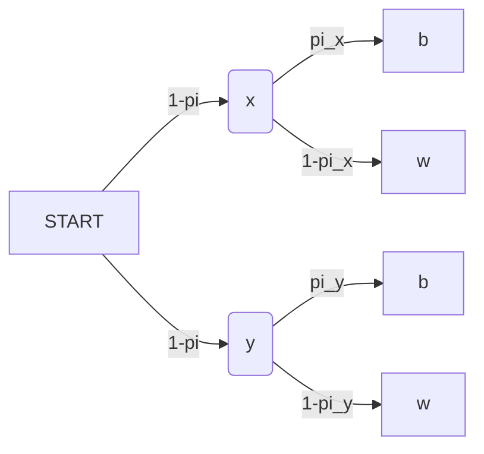
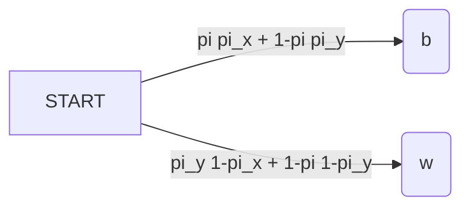

[Back](00.md)

## 2023-10-02

### $C_4$ Indipendence Axiom

Let  
$(x, y, \pi)$ and $(x, z, \pi)$ be any two lotteries  
then  
$y \succeq z $  
$\leftrightarrow$ 
$(x, y, \pi) \succeq (x, z, \pi)$

---

### $C_5$

For simplicity we also assume that there exists a best lottery $b$, as well as a worst lottery $w$.

---

### $C_6$

Let $x,k,z$ be payoffs for which $x>k>z$.  
Then, there exists a $\pi$ such that  
$(x,z,\pi) \sim k$

---

### $C_7$

Let $x > y$ then  
$(x,z,\pi_1) \succeq (x,z,\pi_2) \leftrightarrow \pi_1>\pi_2$

---

## Theorem

If axioms $C_1$ to $C_2$ are satisfied, then there exists a utility function $u$ defined on sure things such that:  

$H((x_1, y_1, \pi_1)) = \pi u(x)+(1-\pi)u(y)$

(H is defined on random variables, u is defined on sure values)

---

## Proof

Without loss of generality

$H() =$  Expected utility 

$H(b) = 1$  
$H(w) = 0$

For all other lotteries $z$ define $H(z) = \pi_z$  
where $\pi_z$ satisfies $(b,w,\pi_z)\sim z \rightarrow$ ($C_6$)

For the the fuction $H(z)$ to be well defined  
$\pi_z$ (the result)  

- Has to be
  - Real
    - Exitst by $C_6$
  - Unique
    - By $C_7$

---

Is $\pi_z$ unique?

>$C_7$  
>Let $x > y$ then  
>$(x,z,\pi_1) \succeq (x,z,\pi_2) \leftrightarrow \pi_1>\pi_2$

By $C_7$, $\pi_z$ is unique. Assume, to the contrary:  
$H(z)=\pi_z$  
$H(z)=\pi_z'$ 
where $\pi_z > \pi_z'$ 

then 

$z \sim (b,w,\pi) \succ  (b,w,\pi') \sim z$ is a **contradiction**!  
We proved per contrarium impossibile that $\pi_z$ is unique!

---

Further more we have to prove that $H(z)$ is a proper utility function that grows

Let us consider two lotteries $m$ and $n$ $(m \succ n)$  
$m \sim (b,w,\pi_m) \succ n \sim (b,w,\pi_m)$  
$\leftrightarrow$  
$\pi_m > \pi_n$  
$\leftrightarrow$  
$H(m)>H(n)$

---

Lastly, we want to show that $H$ can be represented as an expected utility.  
Let $x$ and $y$ be monetary payments and $\pi$ a probability.

(Since $x$ holds no risk, instead of $\pi$ in the lottery, we have 1)

$u(x) \equiv H((x,y,1)) = \pi_x: x \sim (b,w,\pi_x)$

$u(y) \equiv H((y,x,1)) = \pi_y: y \sim (b,w,\pi_y)$

So if we consider

$(x,y,\pi) \sim ((b,w,\pi_x), (b,w,\pi_y), \pi)  $

### OR

---

So  
$(x,y,\pi) \sim ((b,w,\pi_x), (b,w,\pi_y, \pi))  \sim (b,w,\pi,\pi_x+(1-\pi)\pi_y)$ 

$H((x,y\pi)) = \pi\pi_2 + (1+\pi)\pi_y = \pi u(x) + (1-\pi)u(y)$

Furthermore

H is unique up to a positive linear transformation

$V = aH+b, a>0$