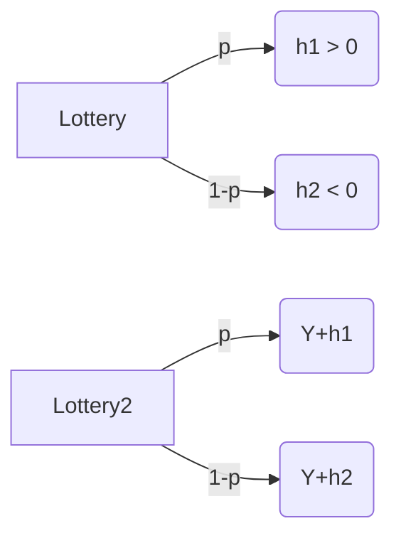
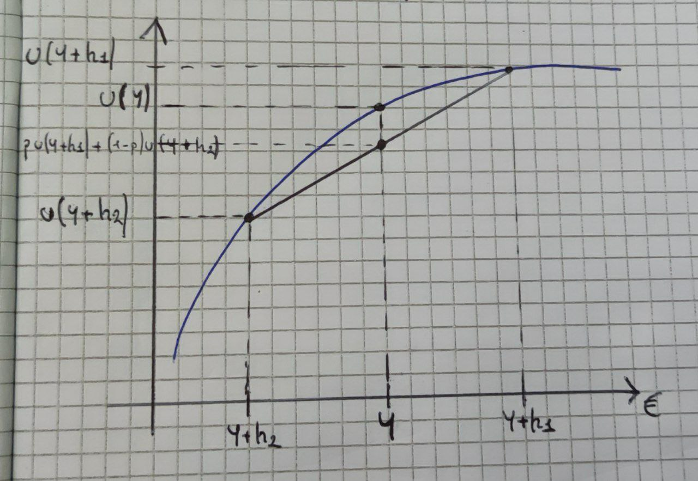

[Back](00.md)

## 2023-10-03

### von Neumann - Morgestern Theroem

>**$C_4$ Indipendence Axiom**
>
>Let  
>$(x, y, \pi)$ and $(x, z, \pi)$ be any two lotteries  
>then  
>$y \succeq z $  
>$\leftrightarrow$ 
>$(x, y, \pi) \succeq (x, z, \pi)$

### The Allais Paradox

The Allais paradox is a choice problem designed by Maurice Allais to show an inconsistency of actual observed choices with the predictions of expected utility theory.

Consider the following lotteries:

$L^1 = (10k, 0, 0.1)$

$L^2 = (15k, 0, 0.09)$

Most individuals choose $L^2$  
>$L^2 \succ L^1$  

$L^3 = (10k, 0, 1)$

$L^4 = (15k, 0, 0.9)$

Most individuals choose $L^3$, as there is no risk.  
>$L^3 \succ L^4$  

---

$L^1= (L^3, L^0, 0.1) \rightarrow (10k, 0, 0.1)$  
$L^0 = (0, 0, 1)$  
$L^2 = (L^4, L^0, 0.1) \rightarrow (15k, 0, 0.1)$

$(L^3, L^0, 0.1) \succ (L^4, L^0, 0.1)$  
>$L^1 \succ L^2$  

But this contradicts individual preferences shown above!

---

The theorem is still valid, even if sometimes there are violations of choices under uncertainties.

---

### Measuring Risk Aversion

Consider an individual with an initial wealth Y.

Financial contract where he receives:

|Return|Probability|
|--- | --- |
| $h$ | $\frac{1}{2}$ |
| $-h$ | $\frac{1}{2}$ |

A risk averse investor would never take part with such a contract.

$u(Y) > \frac{1}{2}(Y+h)+\frac{1}{2}u(Y-h)$

This inequality can be satisfied for all levels of Y if the utility function $u$ is **strictly concave**.

In general consider a gamble where:  

The gamble is said to be actuary fair if  
$ph_1 + (1-p)h_2 = 0$

An individual is said to be risk averse if they are unwilling to accept (or is indifferent to) any actuarially unfair gamble.

Risk averse investor:   
$a(Y) \succeq pu(Y+h_1)+(1-p)u(Y+h_2)$

So
>$ph_1 + (1-p)h_2 = 0$

$p(Y+h_1) + (1-p)(Y+h_2) = pY+ph_1+(1-p)Y+(1+p)h_2 = Y$

Black line is the utility of a linear utility function (risk neutral), blue line is strictly concave (risk averse).

>Courtesy of Luca Tagliaferro

For a risk lover investor:

$a(Y) \preceq pu(Y+h_1)+(1-p)u(Y+h_2)$
The same graph but the blue line is convex.

---

In general investors are risk-averse.

If a function has a second derivative which is negative, it is concave.

$u'' < 0$ Risk Aversion

For a risk averse investor, we would be tempted to say that investor A is more risk averse than B.

$|u''_a (Y)| > |u''_b(Y)|$

If two individuals differ only by a differ transformation (*von Neumann - Morgestern Theroem*) they have to be identical!

$u(x) \rightarrow u''(x)/u'(x)$  
$v(x) = au(x)+b, a>0$  
$v''(x) = u''(x)+u''(x)$

---

### Measures of risk aversion

$R_A(Y) = \frac{u''(x)}{u'(x)}$ Absolute

$R_R(Y) = YR_A(Y) = -Y\frac{u''(x)}{u'(x)}$ Relative

$\frac{1}{R_R(Y)}, \frac{1}{R_A(Y)}$ Tolerances

